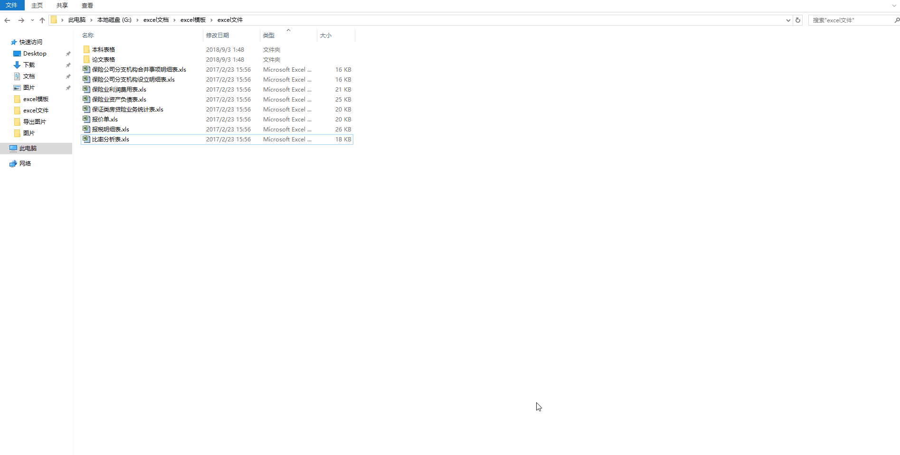

# XLS文件批量转XLSX



VBA代码如下（复制即可）：
```
 

'***********访问当前文件夹下所有子文件夹及文件,
Dim iFile(1 To 100000) As String
Dim count As Integer
Sub xls2xlsx()
    iPath = ThisWorkbook.Path
    On Error Resume Next
    count = 0
    zdir iPath
    For i = 1 To count
        If iFile(i) Like "*.xls" And iFile(i) <> ThisWorkbook.FullName Then
            MyFile = iFile(i)
            FilePath = Replace(MyFile, ".xls", ".xlsx")
            If Dir(FilePath, 16) = Empty Then
                Set WBookOther = Workbooks.Open(MyFile)
                Application.ScreenUpdating = False
                ActiveWorkbook.SaveAs Filename:=FilePath, FileFormat:=xlOpenXMLWorkbook, CreateBackup:=False
                WBookOther.Close SaveChanges:=False      '解决不能close 文件问题
                Application.ScreenUpdating = True
            End If
        End If
    Next
End Sub
Sub zdir(p)       '访问当前文件夹下所有子文件夹及文件
  Set fs = CreateObject("scripting.filesystemobject")
  For Each f In fs.GetFolder(p).Files
    If f <> ThisWorkbook.FullName Then count = count + 1: iFile(count) = f
  Next
  For Each m In fs.GetFolder(p).SubFolders
      zdir m
  Next
End Sub

```